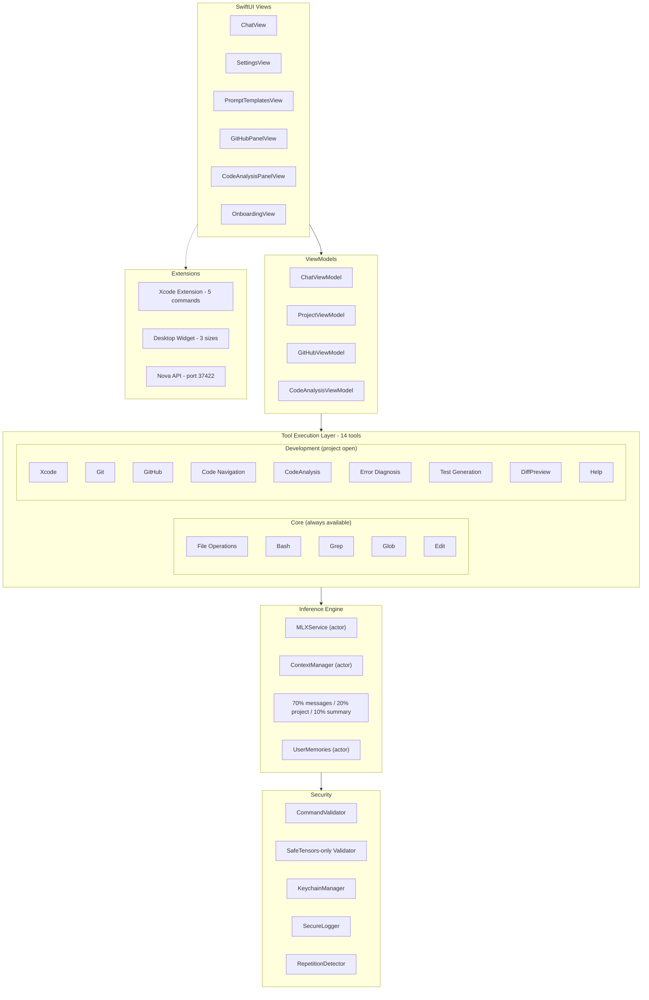
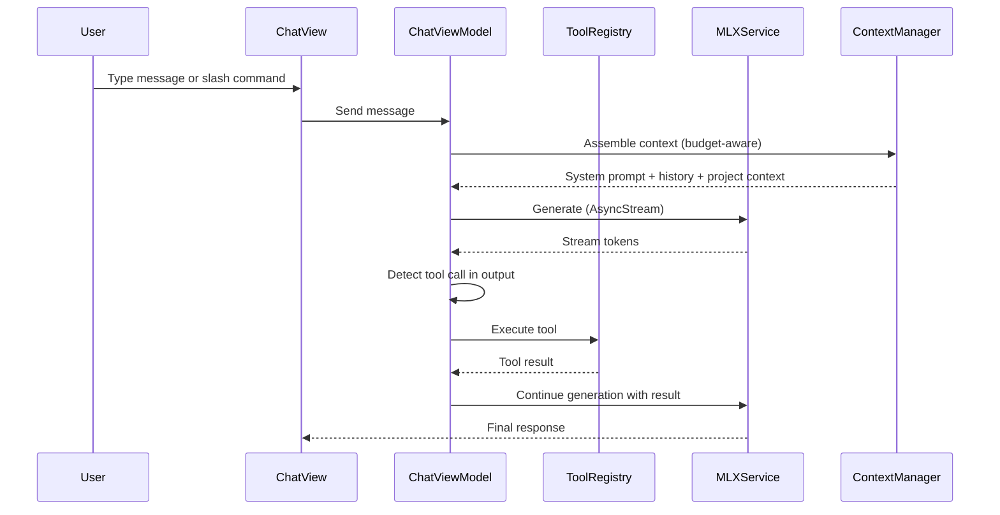

# MLX Code


A local AI coding assistant for macOS, powered by Apple MLX. No cloud. No subscriptions. No data leaving your machine.

MLX Code runs language models directly on Apple Silicon using the [mlx-swift](https://github.com/ml-explore/mlx-swift) framework. It provides a chat interface with 14 built-in tools that can read files, search code, run shell commands, build Xcode projects, manage Git repos, and interact with GitHub -- all driven by a local model running on your GPU.

Written by Jordan Koch.

---

## Architecture


```mermaid
graph TB
    subgraph Views["SwiftUI Views"]
        ChatView
        SettingsView
        PromptTemplatesView
        GitHubPanelView
        CodeAnalysisPanelView
        OnboardingView
    end

    subgraph ViewModels
        ChatVM["ChatViewModel"]
        ProjectVM["ProjectViewModel"]
        GitHubVM["GitHubViewModel"]
        CodeAnalysisVM["CodeAnalysisViewModel"]
    end

    subgraph Tools["Tool Execution Layer - 14 tools"]
        direction LR
        subgraph Core["Core (always available)"]
            FileOps["File Operations"]
            Bash
            Grep
            Glob
            Edit
        end
        subgraph Dev["Development (project open)"]
            Xcode
            Git
            GitHub
            CodeNav["Code Navigation"]
            CodeAnalysis
            ErrorDiag["Error Diagnosis"]
            TestGen["Test Generation"]
            DiffPreview
            Help
        end
    end

    subgraph Engine["Inference Engine"]
        MLXService["MLXService (actor)"]
        ContextManager["ContextManager (actor)"]
        ContextBudget["70% messages / 20% project / 10% summary"]
        UserMemories["UserMemories (actor)"]
    end

    subgraph Security
        CommandValidator
        ModelSecurityValidator["SafeTensors-only Validator"]
        KeychainManager
        SecureLogger
        RepDetector["RepetitionDetector"]
    end

    subgraph External["Extensions"]
        XcodeExt["Xcode Extension - 5 commands"]
        Widget["Desktop Widget - 3 sizes"]
        NovaAPI["Nova API - port 37422"]
    end

    Views --> ViewModels
    ViewModels --> Tools
    Tools --> Engine
    Engine --> Security
    Views -.-> External
```

### Data Flow


```mermaid
sequenceDiagram
    participant User
    participant ChatView
    participant ChatViewModel
    participant ToolRegistry
    participant MLXService
    participant ContextManager

    User->>ChatView: Type message or slash command
    ChatView->>ChatViewModel: Send message
    ChatViewModel->>ContextManager: Assemble context (budget-aware)
    ContextManager-->>ChatViewModel: System prompt + history + project context
    ChatViewModel->>MLXService: Generate (AsyncStream)
    MLXService-->>ChatViewModel: Stream tokens
    ChatViewModel->>ChatViewModel: Detect tool call in output
    ChatViewModel->>ToolRegistry: Execute tool
    ToolRegistry-->>ChatViewModel: Tool result
    ChatViewModel->>MLXService: Continue generation with result
    MLXService-->>ChatView: Final response
```

---

## Features

### 14 Built-in Tools

| Tool | Purpose | Tier |
|---|---|---|
| **File Operations** | Read, write, edit, list, delete files | Core |
| **Bash** | Run shell commands | Core |
| **Grep** | Search file contents with regex | Core |
| **Glob** | Find files by pattern | Core |
| **Edit** | Apply targeted file edits | Core |
| **Xcode** | Build, test, clean, archive, deploy | Dev |
| **Git** | Status, diff, commit, branch, log, push, pull | Dev |
| **GitHub** | Issues, PRs, branches, credential scanning | Dev |
| **Code Navigation** | Jump to definitions, find symbols | Dev |
| **Code Analysis** | Metrics, dependencies, lint | Dev |
| **Error Diagnosis** | Analyze and explain build errors | Dev |
| **Test Generation** | Create unit tests from source files | Dev |
| **Diff Preview** | Show before/after file changes | Dev |
| **Help** | List available commands and usage | Dev |

Read-only tools auto-approve. Write and execute tools require confirmation.

### Slash Commands

```
/commit    /review    /test      /docs
/refactor  /explain   /optimize  /fix
/search    /plan      /help      /clear
```

### Prompt Engineering Toolkit

15 curated prompt templates across 9 categories (Review, Debug, Generate, Refactor, Test, Document, Security, Performance, Deploy). Browse templates, fill variables, preview rendered prompts, and send -- all in-app.

### Xcode Source Editor Extension

Select code in Xcode and invoke from **Editor > MLX Code**:

- Explain Selection
- Refactor Selection
- Generate Tests
- Fix Issues
- Ask MLX Code (opens with code pre-loaded)

Communicates via shared App Group container and `mlxcode://` URL scheme.

### Desktop Widget (WidgetKit)

Three sizes (small, medium, large) showing model status, token speed, memory usage, and quick-action deep links.

### GitHub Integration

View and create issues, list and create PRs, manage branches, scan for exposed credentials before pushing.

### User Memories

50+ built-in coding standards across 8 categories injected into the system prompt at runtime. Custom memories stored locally.

### Context Management

- Token budgeting: 70% messages, 20% project context, 10% summary
- Automatic message compaction when context fills up
- Real-time context window usage bar synced to model size
- Project context auto-included when a workspace is open

### Syntax Highlighting

Code blocks render with highlighting for Swift, Python, JavaScript, TypeScript, Bash, JSON, and Objective-C.

---

## Models

Uses [mlx-community](https://huggingface.co/mlx-community) models from Hugging Face, quantized for Apple Silicon.

| Model | Size | Context | Best for |
|---|---|---|---|
| **Qwen 2.5 7B** (default) | ~4 GB | 32K | General coding, tool calling |
| Mistral 7B v0.3 | ~4 GB | 32K | Versatile, instructions |
| DeepSeek Coder 6.7B | ~4 GB | 16K | Code-specific tasks |
| Qwen 2.5 14B | ~8 GB | 32K | Best quality (16GB+ RAM) |

Models download automatically via native Hub Swift API. Custom models from any mlx-community repository are supported. All models must be **SafeTensors** format -- PyTorch pickle files are rejected.

---

## Nova API Server

Local HTTP API on port **37422** (loopback only).

| Method | Endpoint | Description |
|---|---|---|
| GET | /api/status | App status, model state, uptime |
| GET | /api/ping | Health check |
| GET | /api/conversations | List all conversations |
| POST | /api/chat | Send message, get response |
| GET | /api/model | Current model info |
| POST | /api/model/load | Load a model |
| GET | /api/metrics | Performance metrics (tokens/sec, memory) |
| POST | /api/cancel | Cancel current generation |
| GET | /api/prompts | List prompt templates |
| POST | /api/prompts/render | Render template with variables |

---

## Requirements

- **macOS 14.0** (Sonoma) or later
- **Apple Silicon** (M1, M2, M3, M4)
- **8 GB RAM** minimum (16 GB recommended)
- **No Python required** -- inference and downloads are pure Swift
- **Xcode 15+** -- only needed for the Source Editor Extension

## Installation

### From DMG

Download from [Releases](https://github.com/kochj23/MLXCode/releases), open the DMG, drag to Applications, launch, download a model from Settings.

### From Source

```bash
git clone git@github.com:kochj23/MLXCode.git
cd MLXCode
open "MLX Code.xcodeproj"
# Build: Cmd+R (Xcode 15+, macOS 14.0+ target)
```

### Enabling the Xcode Extension

1. System Settings > Privacy & Security > Extensions > Xcode Source Editor
2. Enable **MLX Code**
3. Restart Xcode
4. Select code, then Editor > MLX Code

---

## Security

- **100% local inference** -- no prompts or responses leave your machine
- **CommandValidator** blocks dangerous shell patterns (rm -rf, fork bombs, sudo, eval, curl|sh)
- **ModelSecurityValidator** enforces SafeTensors-only, verifies hashes via CryptoKit
- **KeychainManager** stores API keys in macOS Keychain
- **SecureLogger** with category-based logging, no PII in logs
- **RepetitionDetector** breaks inference loops automatically
- No telemetry, analytics, or crash reporting

---

## What It Does Not Do

- No web browsing or URL fetching
- No image/video/audio generation
- Small model constraints (3-14B parameters) mean imperfect multi-step reasoning
- Tool calling from local models is sometimes malformed (JSON auto-repair helps)
- Xcode extension opens a separate window rather than responding inline

---

## Test Suite

618 tests across 27 test files covering models, services, security, context budgeting, build parsing, Keychain, tool registry, JSON repair, prompt templates, and source-level security scanning.

```bash
xcodebuild -project "MLX Code.xcodeproj" -scheme "MLX Code" \
  -destination "platform=macOS" test
```

---

## License

MIT License -- Copyright 2025-2026 Jordan Koch

See [LICENSE](LICENSE) for the full text.

---

Written by Jordan Koch ([@kochj23](https://github.com/kochj23))
