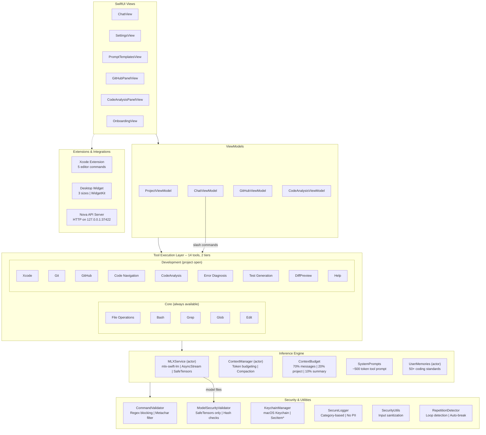
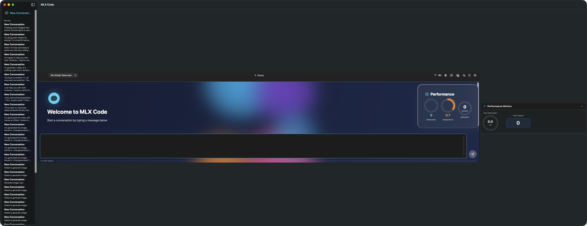

# MLX Code


A local AI coding assistant for macOS, powered by Apple MLX. No cloud. No subscriptions. No data leaving your machine.

MLX Code runs language models directly on Apple Silicon using the [mlx-swift](https://github.com/ml-explore/mlx-swift) framework. It provides a chat interface with 14 built-in tools that can read files, search code, run shell commands, build Xcode projects, manage Git repos, and interact with GitHub -- all driven by a local model running on your GPU.

---

## Architecture


```mermaid
graph TB
    subgraph Views["SwiftUI Views"]
        ChatView
        SettingsView
        PromptTemplatesView
        GitHubPanelView
        CodeAnalysisPanelView
        OnboardingView
    end

    subgraph ViewModels["ViewModels"]
        ChatVM["ChatViewModel"]
        ProjectVM["ProjectViewModel"]
        GitHubVM["GitHubViewModel"]
        CodeAnalysisVM["CodeAnalysisViewModel"]
    end

    subgraph Tools["Tool Execution Layer -- 14 tools, 2 tiers"]
        direction LR
        subgraph Core["Core (always available)"]
            FileOps["File Operations"]
            Bash
            Grep
            Glob
            Edit
        end
        subgraph Dev["Development (project open)"]
            Xcode
            Git
            GitHub
            CodeNav["Code Navigation"]
            CodeAnalysis
            ErrorDiag["Error Diagnosis"]
            TestGen["Test Generation"]
            DiffPreview
            Help
        end
    end

    subgraph Engine["Inference Engine"]
        MLXService["MLXService (actor)\nmlx-swift-lm | AsyncStream | SafeTensors"]
        ContextManager["ContextManager (actor)\nToken budgeting | Compaction"]
        ContextBudget["ContextBudget\n70% messages | 20% project | 10% summary"]
        SystemPrompts["SystemPrompts\n~500 token tool prompt"]
        UserMemories["UserMemories (actor)\n50+ coding standards"]
    end

    subgraph Security["Security & Utilities"]
        CommandValidator["CommandValidator\nRegex blocking | Metachar filter"]
        ModelSecurity["ModelSecurityValidator\nSafeTensors only | Hash checks"]
        Keychain["KeychainManager\nmacOS Keychain | SecItem*"]
        SecureLogger["SecureLogger\nCategory-based | No PII"]
        SecurityUtils["SecurityUtils\nInput sanitization"]
        RepDetector["RepetitionDetector\nLoop detection | Auto-break"]
    end

    subgraph External["Extensions & Integrations"]
        XcodeExt["Xcode Extension\n5 editor commands"]
        Widget["Desktop Widget\n3 sizes | WidgetKit"]
        NovaAPI["Nova API Server\nHTTP on 127.0.0.1:37422"]
    end

    Views --> ViewModels
    ViewModels --> Tools
    Tools --> Engine
    Engine --> Security
    MLXService --> |"model files"| ModelSecurity
    ChatVM --> |"slash commands"| Tools
    Views -.-> External
```

### Detailed Architecture (ASCII)

```
+-----------------------------------------------------------------------------------+
|                              MLX Code (macOS App)                                 |
|                                                                                   |
|  +---------------------------+    +--------------------------------------------+  |
|  |        SwiftUI Views      |    |              ViewModels                     |  |
|  |                           |    |                                            |  |
|  |  ChatView                 |    |  ChatViewModel                             |  |
|  |    MessageRowView         |    |    Conversation state & tool execution     |  |
|  |    CodeBlockView          |    |    Streaming token display                 |  |
|  |    CollapsibleToolResult  |    |    Slash command dispatch                  |  |
|  |    ToolApprovalView       |    |                                            |  |
|  |    ThinkingIndicatorView  |    |  ProjectViewModel                          |  |
|  |  CommandPalette           |    |    Build, archive, deploy operations       |  |
|  |  PromptTemplatesView      |    |                                            |  |
|  |  SettingsView             |    |  GitHubViewModel                           |  |
|  |  OnboardingView           |    |    Issues, PRs, branches                   |  |
|  |  DiffView                 |    |                                            |  |
|  |  GitHubPanelView          |    |  CodeAnalysisViewModel                     |  |
|  |  CodeAnalysisPanelView    |    |    Metrics, dependencies, lint             |  |
|  +---------------------------+    +--------------------------------------------+  |
|                |                                     |                            |
|                |           User messages              |                            |
|                +------------------+-------------------+                            |
|                                   |                                                |
|                                   v                                                |
|  +-------------------------------------------------------------------------+      |
|  |                         Tool Execution Layer                            |      |
|  |                                                                         |      |
|  |  ToolRegistry (14 tools, 2 tiers)                                       |      |
|  |  +-----------+  +-----------+  +----------+  +----------+  +---------+  |      |
|  |  | File Ops  |  |   Bash    |  |   Grep   |  |   Glob   |  |  Edit   |  |      |
|  |  +-----------+  +-----------+  +----------+  +----------+  +---------+  |      |
|  |       CORE           CORE          CORE          CORE          CORE     |      |
|  |                                                                         |      |
|  |  +-----------+  +-----------+  +----------+  +----------+  +---------+  |      |
|  |  |   Xcode   |  |    Git    |  |  GitHub  |  | CodeNav  |  |CodeAnal.|  |      |
|  |  +-----------+  +-----------+  +----------+  +----------+  +---------+  |      |
|  |  +-----------+  +-----------+  +----------+  +----------+               |      |
|  |  | ErrorDiag |  | TestGen   |  |DiffPreview| |   Help   |               |      |
|  |  +-----------+  +-----------+  +----------+  +----------+               |      |
|  |       DEVELOPMENT tier (available when a project is open)               |      |
|  +-------------------------------------------------------------------------+      |
|                                   |                                                |
|                                   v                                                |
|  +-------------------------------------------------------------------------+      |
|  |                          Inference Engine                               |      |
|  |                                                                         |      |
|  |  MLXService (Swift actor)                                               |      |
|  |    - Native mlx-swift-lm: LLMModelFactory + ModelContainer              |      |
|  |    - Chat templates via tokenizer (Jinja), flat-prompt fallback         |      |
|  |    - AsyncStream<Generation> for token streaming                        |      |
|  |    - SafeTensors-only model loading (PyTorch pickle rejected)           |      |
|  |    - Native HuggingFace Hub downloads (no Python)                       |      |
|  |                                                                         |      |
|  |  ContextManager (actor)           ContextBudget                         |      |
|  |    - Token estimation             - Budget allocation:                  |      |
|  |    - Message compaction             70% messages / 20% project /        |      |
|  |    - Project context inclusion      10% summary                         |      |
|  |                                                                         |      |
|  |  SystemPrompts                    UserMemories (actor)                  |      |
|  |    - ~500 token tool prompt       - 50+ built-in coding standards       |      |
|  |    - Compact tool descriptions    - 8 categories of rules               |      |
|  |    - Runtime memory injection     - Custom memories stored locally      |      |
|  +-------------------------------------------------------------------------+      |
|                                                                                   |
|  +-------------------------------------------------------------------------+      |
|  |                       Security & Utilities                              |      |
|  |                                                                         |      |
|  |  CommandValidator         ModelSecurityValidator    KeychainManager     |      |
|  |    - Regex pattern block    - SafeTensors only       - Secure storage   |      |
|  |    - Shell metachar filter  - Trusted sources        - API key mgmt     |      |
|  |    - Audit logging          - Hash verification                         |      |
|  |                                                                         |      |
|  |  SecureLogger             SecurityUtils              RepetitionDetector |      |
|  |    - Category-based logs    - Input sanitization     - Loop detection   |      |
|  |    - No PII in logs         - Command validation     - Auto-break       |      |
|  +-------------------------------------------------------------------------+      |
|                                                                                   |
+----------|---------------------|-----------------------|--------------------------+
           |                     |                       |
           v                     v                       v
+-------------------+  +-------------------+  +-------------------------+
| Xcode Extension   |  | Desktop Widget    |  | Nova API Server         |
|                   |  |                   |  |                         |
| 5 Editor commands |  | Small / Med / Lrg |  | HTTP on 127.0.0.1:37422 |
| Shared App Group  |  | Model status      |  |                         |
| mlxcode:// scheme |  | Token speed       |  | /api/status             |
|                   |  | Memory usage      |  | /api/chat               |
| Explain Selection |  | Quick actions     |  | /api/conversations      |
| Refactor          |  |                   |  | /api/model              |
| Generate Tests    |  | WidgetKit         |  | /api/metrics            |
| Fix Issues        |  | 5-min refresh     |  | /api/prompts            |
| Ask MLX Code      |  |                   |  | /api/cancel             |
+-------------------+  +-------------------+  +-------------------------+
```

**Key design decisions:**

- **Pure Swift inference** -- `mlx-swift-lm` framework, no Python dependency anywhere in the pipeline
- **Actor isolation** -- `MLXService`, `ContextManager`, and `UserMemories` are Swift actors for thread safety
- **SafeTensors only** -- PyTorch pickle files (.bin, .pt) are rejected at both discovery and load time
- **Compact prompts** -- Tool descriptions fit in ~500 tokens, not 4,000, leaving room for conversation
- **Two tool tiers** -- Core tools always available; development tools appear when a project is open
- **Budget-aware context** -- Token allocations: 70% recent messages, 20% project context, 10% summary

---

## Features

### Chat-Based Coding Assistant

Type a message, and the model reads files, searches code, runs commands, and builds your project. The 14 built-in tools cover the full development workflow:

| Tool | Purpose | Tier |
|------|---------|------|
| **File Operations** | Read, write, edit, list, delete files | Core |
| **Bash** | Run shell commands | Core |
| **Grep** | Search file contents with regex | Core |
| **Glob** | Find files by pattern | Core |
| **Edit** | Apply targeted file edits | Core |
| **Xcode** | Build, test, clean, archive, full deploy pipeline | Dev |
| **Git** | Status, diff, commit, branch, log, push, pull | Dev |
| **GitHub** | Issues, PRs, branches, credential scanning | Dev |
| **Code Navigation** | Jump to definitions, find symbols | Dev |
| **Code Analysis** | Metrics, dependencies, lint, symbols | Dev |
| **Error Diagnosis** | Analyze and explain build errors | Dev |
| **Test Generation** | Create unit tests from source files | Dev |
| **Diff Preview** | Show before/after file changes | Dev |
| **Help** | List available commands and usage | Dev |

Read-only tools (grep, glob, file read, code navigation) auto-approve. Write and execute tools (bash, file write, xcode build) require confirmation.

### Slash Commands

```
/commit    /review    /test      /docs
/refactor  /explain   /optimize  /fix
/search    /plan      /help      /clear
```

### Xcode Source Editor Extension

Select code in Xcode and invoke from **Editor > MLX Code**:

- **Explain Selection** -- understand what code does
- **Refactor Selection** -- get an improved version
- **Generate Tests** -- write unit tests for the selection
- **Fix Issues** -- find and fix bugs
- **Ask MLX Code** -- open with code pre-loaded, ask anything

The extension communicates via a shared App Group container and the `mlxcode://` URL scheme.

### Prompt Engineering Toolkit

15 curated prompt templates across 9 categories, engineered for local LLMs (Qwen, Phi, Mistral). Browse templates, fill in variables, preview the rendered prompt, and send -- all without leaving the app.

| Category | Templates |
|----------|-----------|
| Review | Swift Code Review, Review PR / Diff |
| Debug | Fix a Bug, Fix Build Error |
| Generate | Implement Feature, Add API Endpoint, Create Data Model |
| Refactor | Refactor File |
| Test | Add Unit Tests |
| Document | Add Documentation, Explain Code |
| Security | Security Audit, Add Error Handling |
| Performance | Performance Analysis |
| Deploy | Migration Plan |

### Desktop Widget (WidgetKit)

Three sizes (small, medium, large) showing model status, token speed, memory usage, and quick-action buttons that deep-link into the app.

### GitHub Integration

The GitHub tool connects to the GitHub API to view and create issues, list and create pull requests, manage branches, and scan for exposed credentials before pushing.

### User Memories

Persistent preferences that shape assistant behavior across conversations. 50+ built-in coding standards across 8 categories (personality, code quality, security, Xcode, git, testing, docs, deployment), plus custom memories stored locally. Injected into the system prompt at runtime -- never hardcoded.

### Context Management

- Token budgeting with automatic message compaction when the context fills up
- Real-time context window usage bar synced to the actual model's context size
- Project context auto-included when a workspace is open
- Budget allocation: 70% recent messages, 20% project context, 10% summary of older messages

### Syntax Highlighting

Code blocks render with syntax highlighting for Swift, Python, JavaScript, TypeScript, Bash, JSON, and Objective-C. Keywords, types, strings, comments, and numbers are all colored.

---

## Nova API Server

MLX Code exposes a local HTTP API on port **37422** for integration with external tools and automations. The server binds to `127.0.0.1` only -- no external network exposure.

```
GET  /api/status              App status, model loaded state, uptime
GET  /api/ping                Health check
GET  /api/conversations       List all conversations
GET  /api/conversations/:id   Single conversation with messages
POST /api/conversations       Create new conversation
DELETE /api/conversations/:id Delete conversation
POST /api/chat                Send a message, get response  {"message": "..."}
GET  /api/model               Current model info
POST /api/model/load          Load a model  {"model": "path"}
GET  /api/metrics             Performance metrics (tokens/sec, memory)
POST /api/cancel              Cancel current generation
GET  /api/prompts             List all prompt templates
GET  /api/prompts/:id         Get a template with variables
POST /api/prompts/render      Render template with filled variables
```

```bash
# Check status
curl -s http://127.0.0.1:37422/api/status | python3 -m json.tool

# Send a message
curl -X POST http://127.0.0.1:37422/api/chat \
  -H "Content-Type: application/json" \
  -d '{"message": "List all Swift files in this project"}'

# Browse prompt templates
curl -s http://127.0.0.1:37422/api/prompts | python3 -m json.tool
```

The API starts automatically when the app launches.

---

## Screenshots



---

## Models

MLX Code uses [mlx-community](https://huggingface.co/mlx-community) models from Hugging Face, quantized for Apple Silicon.

| Model | Size | Context | Best for |
|-------|------|---------|----------|
| **Qwen 2.5 7B** (default) | ~4 GB | 32K | General coding, tool calling |
| Mistral 7B v0.3 | ~4 GB | 32K | Versatile, good at instructions |
| DeepSeek Coder 6.7B | ~4 GB | 16K | Code-specific tasks |
| Qwen 2.5 14B | ~8 GB | 32K | Best quality (needs 16GB+ RAM) |

Models download automatically on first use via the native Hub Swift API. You can also add custom models from any mlx-community repository.

All models must be in **SafeTensors** format. PyTorch pickle files (.bin, .pt) are rejected at both discovery and load time.

---

## Requirements

- **macOS 14.0** (Sonoma) or later
- **Apple Silicon** (M1, M2, M3, M4)
- **8 GB RAM** minimum (16 GB recommended for 7B models)
- **No Python required** -- inference and downloads are pure Swift
- **Xcode 15+** -- only needed for the Source Editor Extension feature

---

## Installation

### Quick Start

1. Download `MLXCode-vX.Y.Z.dmg` from [Releases](https://github.com/kochj23/MLXCode/releases)
2. Open the DMG and drag **MLX Code** to `/Applications`
3. Launch the app
4. Go to **Settings > Models** and download a model
5. Load the model and start chatting

### Enabling the Xcode Extension

1. Open **System Settings > Privacy & Security > Extensions > Xcode Source Editor**
2. Enable **MLX Code**
3. Restart Xcode
4. Select code, then use **Editor > MLX Code** menu

See **[INSTALLATION.md](INSTALLATION.md)** for the full setup guide, including model paths, troubleshooting, and building from source.

### Building from Source

```bash
git clone git@github.com:kochj23/MLXCode.git
cd MLXCode
open "MLX Code.xcodeproj"
```

Build the **MLX Code** scheme in Xcode 15+ targeting macOS 14.0+. The project uses Swift Package Manager for dependencies (mlx-swift, mlx-swift-lm, Hub).

---

## Technical Details

### Frameworks and Dependencies

| Dependency | Purpose |
|------------|---------|
| [mlx-swift](https://github.com/ml-explore/mlx-swift) | Apple MLX framework bindings for Swift |
| [mlx-swift-lm](https://github.com/ml-explore/mlx-swift-examples) | LLM inference: `LLMModelFactory`, `ModelContainer`, `GenerateParameters` |
| [MLXLMCommon](https://github.com/ml-explore/mlx-swift-examples) | Shared types: `UserInput`, `LMInput`, `AsyncStream<Generation>` |
| [Hub](https://github.com/huggingface/swift-transformers) | HuggingFace model downloads via `HubApi.snapshot()` |
| SwiftUI | All views, settings, onboarding, panels |
| WidgetKit | Desktop widget (3 sizes) |
| XcodeKit | Source Editor Extension |
| Network (NWListener) | Nova API HTTP server on loopback |
| CryptoKit | Model file hash verification |
| Security | Keychain storage for API keys |

### Concurrency Model

- `MLXService` is a Swift **actor** -- all model state (load, unload, generate) is automatically serialized
- `ContextManager` and `UserMemories` are also actors
- Token streaming uses `AsyncStream<Generation>`, delivered to `@MainActor` via `MainActor.run`
- All background loops check `Task.isCancelled` for clean shutdown
- Inference breaks immediately when `</tool>` is detected in output, preventing the model from running to maxTokens

### Security

**Shell Execution Safety:**
- `CommandValidator` blocks dangerous patterns (`rm -rf /`, fork bombs, `sudo`, `eval`, `curl | sh`) using regex word-boundary matching
- Shell metacharacters (`;`, `|`, `&`, `$`, backticks) are rejected before pattern matching
- Git and build tools use `Process.currentDirectoryURL` instead of string interpolation
- Write/execute tools require user confirmation; read-only tools auto-approve

**Model Security:**
- Only SafeTensors (.safetensors) format is permitted
- PyTorch pickle files (.bin, .pt) are blocked -- they can execute arbitrary Python code
- `ModelSecurityValidator` verifies trusted sources and file hashes via CryptoKit

**Data Privacy:**
- 100% local inference -- no prompts or responses leave your machine
- No telemetry, analytics, or crash reporting
- No cloud AI services (OpenAI, Anthropic, etc.)
- The only external network calls are to the GitHub API, explicitly invoked by the user
- User memories stored locally, never transmitted

---

## What It Does Not Do

Being honest about limitations:

- **No web browsing** -- cannot fetch URLs or browse the internet
- **No image/video/audio generation** -- this is a code assistant
- **Small model constraints** -- 3-14B parameter models make mistakes, especially with complex multi-step reasoning
- **Tool calling is imperfect** -- local models sometimes format tool calls incorrectly (JSON auto-repair and retry help, but are not perfect)
- **Extension requires app switch** -- the Xcode extension opens MLX Code in a separate window rather than responding inline

---

## Version History

| Version | Date | Highlights |
|---------|------|------------|
| **v6.4.1** | May 2026 | Comprehensive XCTest suite -- 16 test files, ~150 test cases covering models, security, context budgeting, build parsing, Keychain, and source-level security scanning |
| **v6.4.0** | April 2026 | Prompt Engineering Toolkit -- 15 templates, 9 categories, API endpoints, in-app browser |
| **v6.3.0** | March 2026 | Xcode Source Editor Extension, native downloads (no Python), syntax highlighting, collapsed tool calls, accurate context bar, resume generation, SafeTensors-only loading |
| **v6.2.0** | March 2026 | Replaced Python subprocess with native mlx-swift-lm inference, removed 2,726 lines of dead code |
| **v6.1.x** | March 2026 | Security audit (31 findings resolved), Keychain migration, SecureLogger |
| **v6.0.0** | February 2026 | GitHub integration, code analysis, Xcode deploy pipeline, user memories, 14 tools |
| **v5.0.0** | February 2026 | Major simplification -- deleted 41 files (~16,000 lines), compact system prompt, Qwen 2.5 default |
| **v4.0.0** | February 2026 | Chat templates, tool tier system, context budgeting, tool approval flow |
| **v1.x** | Jan-Feb 2026 | Initial release, MLX backend, desktop widget, basic chat |

---

## Roadmap

- **Deeper Xcode integration** -- write responses back into the editor buffer without switching apps
- **Structured output** -- grammar-constrained generation to guarantee well-formed tool calls from smaller models
- **Streaming download progress** -- real-time progress bar for model downloads

---

## Project Structure

```
MLX Code/
  MLXCodeApp.swift                 App entry point
  Models/                          Data models (Message, Conversation, MLXModel, AppSettings)
  Services/
    MLXService.swift               Native MLX inference engine (actor)
    ContextManager.swift           Token budgeting and message compaction
    ContextBudget.swift            Budget allocation ratios
    NovaAPIServer.swift            HTTP API on port 37422
    GitHubService.swift            GitHub API client
    GitService.swift               Local git operations
    XcodeService.swift             Xcode build/test/archive
    UserMemories.swift             Persistent user preferences
    ConversationManager.swift      Conversation persistence
    FileService.swift              File system operations
    SessionManager.swift           Session lifecycle
    SlashCommandHandler.swift      Slash command dispatch
    XcodeActionHandler.swift       Handles requests from Xcode extension
    ModelSecurityValidator.swift   SafeTensors validation + hash checks
  Tools/
    ToolRegistry.swift             Central tool registry and dispatcher
    ToolProtocol.swift             Tool interface definition
    ToolTier.swift                 Core vs. development tier classification
    SystemPrompts.swift            System prompt generation with tool + memory injection
    PromptTemplates.swift          15 curated prompt templates
    BashTool.swift                 Shell command execution
    FileOperationsTool.swift       File CRUD
    GrepTool.swift                 Content search
    GlobTool.swift                 File pattern matching
    EditTool.swift                 Targeted file edits
    XcodeTool.swift                Build, test, archive, deploy
    GitIntegrationTool.swift       Git operations
    GitHubTool.swift               GitHub API tool
    CodeNavigationTool.swift       Symbol lookup and navigation
    CodeAnalysisTool.swift         Metrics, deps, lint
    ErrorDiagnosisTool.swift       Build error analysis
    TestGenerationTool.swift       Unit test generation
    DiffPreviewTool.swift          Before/after diff display
    HelpTool.swift                 Command help
    MemorySystem.swift             Tool execution memory
  Views/                           SwiftUI views (ChatView, SettingsView, etc.)
  ViewModels/                      ChatViewModel, ProjectViewModel, GitHubViewModel, etc.
  Utilities/
    CommandValidator.swift         Shell command security validation
    SecureLogger.swift             Category-based secure logging
    KeychainManager.swift          macOS Keychain wrapper
    SecurityUtils.swift            Input sanitization
    RepetitionDetector.swift       Detects and breaks inference loops
    BuildErrorParser.swift         Xcode build error parsing

MLX Code Extension/                Xcode Source Editor Extension (5 commands)
  SourceEditorExtension.swift      Extension entry point
  SourceEditorCommand.swift        Command handler, App Group IPC

MLX Code Widget/                   WidgetKit desktop widget (3 sizes)
  MLXCodeWidget.swift              Small, medium, large widget views
  SharedDataManager.swift          App Group data sync
  WidgetData.swift                 Widget data model

MLX Code Tests/                    Unit tests (16 test files, ~150 test cases)
```

---

## Test Suite

The project includes a comprehensive XCTest suite covering unit tests, functional tests, and security tests. All tests compile and run without warnings (`-warnings-as-errors` is enabled).

| Test File | Coverage Area | Key Tests |
|-----------|--------------|-----------|
| **AppSettingsTests** | Settings persistence, validation, defaults | Temperature clamping, path validation, save/load round-trip |
| **CommandValidatorTests** | Shell command security | Injection prevention, metachar blocking, word-boundary regex, whitelist enforcement, SSRF prevention |
| **ContextManagerTests** | Token budgeting, context assembly | Token estimation, budget calculations, message compaction, summary generation |
| **ContextBudgetTests** | Budget allocation ratios | 70/20/10 ratio validation, model heuristics, output reservation caps |
| **JSONRepairTests** | Tool-call JSON parsing | Single-quote repair, trailing commas, legacy format fallback, nested JSON |
| **MLXServiceTests** | Model loading, daemon communication | JSON response decoding, path validation, file system access |
| **MessageTests** | Message model | Creation, Codable round-trip, validation, sanitized content, API key redaction |
| **ConversationTests** | Conversation model | Message management, auto-title, JSON export/import, validation |
| **MLXModelTests** | Model configuration | Parameter validation, Codable, factory methods, formatted size |
| **RepetitionDetectorTests** | Loop detection | Pattern detection, buffer management, excessive repetition |
| **BuildErrorParserTests** | Xcode build output parsing | Error/warning extraction, categorization, suggestions, summary |
| **KeychainManagerTests** | Secure credential storage | Save/load/delete, overwrite, special characters, error types |
| **PromptTemplateTests** | Template rendering | Variable substitution, Codable, equality, performance |
| **PromptTemplateLibraryTests** | Curated template library | Category coverage, unique IDs, variable definitions, rendering |
| **SecurityUtilsTests** | Input validation & sanitization | Path/command/email/URL/port validation, HTML/SQL/shell sanitization |
| **SecurityScanTests** | Source code security audit | No hardcoded API keys, no secrets in UserDefaults, no unsafe C functions, SSRF prevention |

Run the suite:

```bash
xcodebuild -project "MLX Code.xcodeproj" -scheme "MLX Code" \
  -destination "platform=macOS" test
```

---

## License

MIT License -- Copyright 2025-2026 Jordan Koch

See [LICENSE](LICENSE) for the full text.

---

## Disclaimer

This is a personal project created on my own time. It is not affiliated with, endorsed by, or representative of my employer.

---

Written by Jordan Koch
